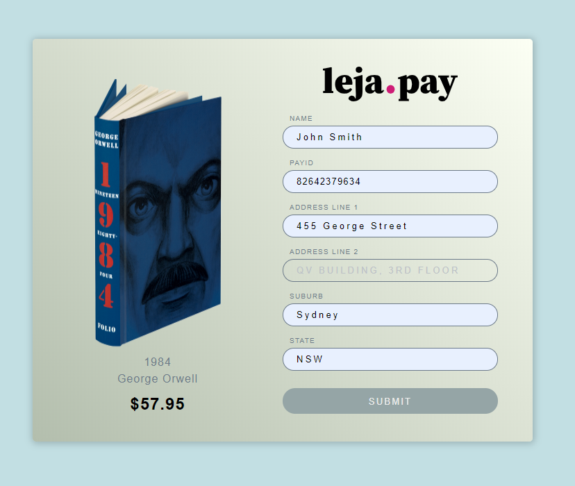

# lejapay

Leja Pay is a simlple example of posting ISO 20022 compliant messages on the BSV blockchain.

ISO 20022 [[1]](#1) is a global open public standard for financial messaging that was started by SWIFT[[2]](#2), the Society for Worldwide Interbank Financial Telecommunication. It's an organisation that was founded in Brussels in 1973 to establish some common processes and standards for financial transactions..

## References
<a id="1">[1]</a>[ISO 20022](https://www.iso20022.org/) 
<a id="2">[2]</a>[SWIFT](https://www.swift.com/)

